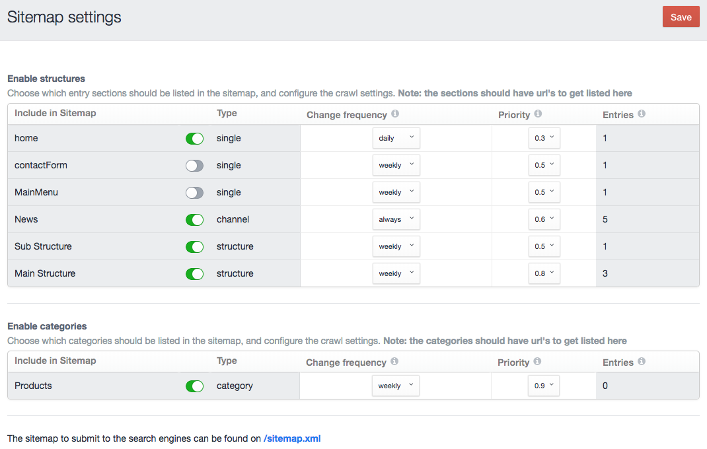

# Craft Commerce Sitemap plugin for Craft CMS 3.x

Craft 3 plugin that provides an easy way to enable and manage a XML sitemap for search engines like Google and Bing.



## Using the Craft Commerce Sitemap plugin

After the installation, you can find the plugin in the settings section of the Control Panel.

You can enable and set the settings per entries section and enable categories in the sitemap.

After saving the desired settings, you can submit the xml url (your site url)/sitemap.xml to the searchengines.

## Sitemap structure
The sitemap is compatible with the [sitemaps.org](https://www.sitemaps.org/protocol.html) protocol.

## Requirements

This plugin requires Craft CMS 3.0.18 or later.

## Installation

```
composer require michaelstivala/commerce-sitemap
```

In the Control Panel, go to Settings → Plugins and click the “Install” button for XML sitemap.


### Contributors & Developers
Michael Stivala - michaelstivala@me.com

Based on the [original plugin](https://github.com/Dolphiq/craft3-plugin-sitemap) by Johan Zandstra and [Dolphiq](https://dolphiq.nl)
